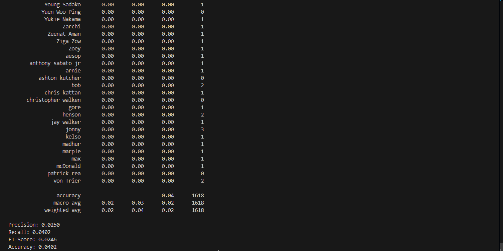
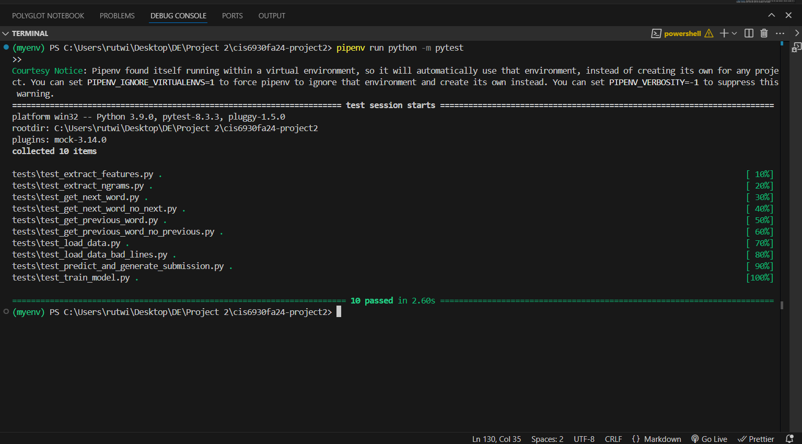

# Unredactor Model

## Introduction
This repository contains a machine learning pipeline for predicting redacted information in masked text. It utilizes text-based feature extraction and a Random Forest Classifier to predict missing segments based on the provided context.

Project demonstration:
https://drive.google.com/file/d/1JIonEIk-4qDqnTvVgaDYiOuYEA3b03HL/view?usp=sharing

## Approach

### 1. **Data Loading and Preprocessing**
   - The dataset is read from a tab-separated file containing the columns: `split`, `name`, and `context`.
   - Rows with invalid or missing data are filtered out to ensure consistency.
   - The data is split into training and validation subsets based on the values in the `split` column:
     - Rows labeled as `train` are used for model training.
     - Rows labeled as `validation` are set aside for performance evaluation.

---

### 2. **Feature Extraction**
   - A variety of features are extracted from the `context` column to enhance model performance:
     - **N-grams**: Unigrams, bigrams, and trigrams derived from the text surrounding the redacted area.
     - **Surrounding Words**: The word immediately preceding and following the redacted text.
     - **Text Statistics**: Basic characteristics of the redacted text, such as:
       - Total number of letters.
       - Total number of spaces.
       - Presence of specific characters or patterns.
   - These features are represented in a structured format suitable for input into the machine learning model.

---

### 3. **Model Training**
   - A **Random Forest Classifier** is selected as the predictive model due to its robustness and ability to handle complex feature spaces.
   - The model is trained using the extracted features and the `name` column as the target variable.
   - Model performance is evaluated on the validation set by calculating the following metrics:
     - **Precision**: The proportion of correctly identified labels among the predicted labels.
     - **Recall**: The proportion of actual labels that were correctly identified.
     - **Accuracy**: The overall percentage of correctly predicted labels.

---

### 4. **Prediction**
   - Once the model is trained, predictions are generated for the test dataset.
   - The predictions correspond to the `name` values for the test data based on the provided `context`.
   - These predictions are saved in a tab-separated file named `submission.tsv`, ensuring compatibility with required submission formats.

--- 

### Summary
This approach systematically preprocesses the data, extracts meaningful features, trains a robust machine learning model, and generates predictions while maintaining a focus on interpretability and performance.


## Function Overview

#### `load_data(file_path)`
- **Purpose**: Load the dataset from a given file path and preprocess it by removing invalid rows. This function separates the data into training and validation sets based on the `split` column, ensuring it is ready for further processing.
- **Parameters**:
  - `file_path` (str): Path to the dataset file, which should be in a tab-separated format.
- **Returns**: A Pandas DataFrame with processed and cleaned data.

---

#### `extract_features(df, is_test=False)`
- **Purpose**: Extract meaningful features from the dataset for model training or prediction. Features include n-grams, surrounding words, and text statistics. If processing test data, default assumptions are applied.
- **Parameters**:
  - `df` (DataFrame): The dataset containing the `context` and `name` columns.
  - `is_test` (bool): Indicates whether the dataset is for testing. Defaults to `False`.
- **Returns**: A DataFrame containing the extracted features for each row.

---

#### `extract_ngrams(text, redacted_length)`
- **Purpose**: Analyze the text to generate unigrams, bigrams, and trigrams around the redacted segment. These features help capture local context, aiding in prediction.
- **Parameters**:
  - `text` (str): The input context containing the redacted segment.
  - `redacted_length` (int): The length of the redacted text segment in characters.
- **Returns**: A dictionary containing lists of unigrams, bigrams, and trigrams derived from the context.

---

#### `get_previous_word(context)`
- **Purpose**: Extract the word immediately preceding the redacted text in the provided context. This feature captures contextual information that may be significant for prediction.
- **Parameters**:
  - `context` (str): The full context string containing the redacted text.
- **Returns**: The word preceding the redacted segment or an empty string if no such word exists.

---

#### `get_next_word(context)`
- **Purpose**: Extract the word immediately following the redacted text in the context. Like the preceding word, this feature provides important context for classification.
- **Parameters**:
  - `context` (str): The full context string containing the redacted text.
- **Returns**: The word following the redacted segment or an empty string if no such word exists.

---

#### `train_model(train_df, val_df)`
- **Purpose**: Train a Random Forest Classifier using the training dataset. The function also evaluates the model on the validation dataset to measure performance using precision, recall, and accuracy.
- **Parameters**:
  - `train_df` (DataFrame): The dataset used to train the model, including extracted features.
  - `val_df` (DataFrame): The dataset used for validation, including features and ground-truth labels.
- **Returns**: The trained Random Forest Classifier model and the vectorizer used for feature transformation.

---

#### `predict_and_generate_submission(model, vectorizer, test_file, output_file='submission.tsv')`
- **Purpose**: Use the trained model to generate predictions on a test dataset and save the results in a tab-separated submission file. Ensures predictions are formatted correctly for evaluation.
- **Parameters**:
  - `model` (RandomForestClassifier): The pre-trained Random Forest model.
  - `vectorizer` (CountVectorizer): The feature vectorizer for transforming text data.
  - `test_file` (str): Path to the test dataset file.
  - `output_file` (str): File path for saving the predictions. Defaults to `'submission.tsv'`.

---

#### `main()`
- **Purpose**: Acts as the entry point to execute the complete pipeline, from data loading to prediction. This function coordinates all other functions in the correct sequence.
- **Steps**:
  1. Load the training and validation data.
  2. Extract features and train the model.
  3. Evaluate the model on the validation dataset.
  4. Predict outcomes on the test dataset.
  5. Save predictions to the specified file.


## Metrics
The model is evaluated using the following metrics:
- **Precision**: Proportion of correct positive predictions.
- **Recall**: Proportion of actual positives identified.
- **Accuracy**: Overall correctness of predictions.
- **F1-score**: The F1-score is the harmonic mean of precision and recall.



## Files
- `unredactor.tsv`: Training and validation dataset.
- `test.tsv`: Test dataset.
- `submission.tsv`: File containing predictions for the test data.

## Usage
1. Ensure all dependencies are installed (`pandas`, `numpy`, `sklearn`).
2. Place the dataset files (`unredactor.tsv`, `test.tsv`) in the working directory.
3. Run the pipeline:
   python main.py

## Required Installation 
```pip install pandas scikit-learn numpy```

## How to run the code
To execute the program and unredact the names, run the following command:

```python unredactor.py unredactor.tsv```

## How to run Test Cases
```pipenv run python -m pytest```

## Test case explanations

### 1. Test: `test_extract_features`

**Function Tested**: `extract_features`

- **Description**: Validates that features are correctly extracted from the input dataset. Ensures columns for unigrams, bigrams, trigrams, previous word, and next word are included in the output.
- **Assertions**:
  - Features dataframe is not empty.
  - Columns `unigrams`, `bigrams`, `trigrams`, `previous_word`, and `next_word` exist.

---

### 2. Test: `test_extract_ngrams`

**Function Tested**: `extract_ngrams`

- **Description**: Tests the extraction of unigrams, bigrams, and trigrams from a given context containing redacted text.
- **Assertions**:
  - Result includes `unigrams`, `bigrams`, and `trigrams`.
  - Each extracted feature is of type `str`.

---

### 3. Test: `test_get_next_word_no_next`

**Function Tested**: `get_next_word`

- **Description**: Ensures the function correctly handles cases where no word follows the redacted text.
- **Assertions**:
  - Returns an empty string when no next word exists.

---

### 4. Test: `test_get_next_word`

**Function Tested**: `get_next_word`

- **Description**: Verifies that the function correctly identifies the word immediately following the redacted text.
- **Assertions**:
  - Returns the correct next word.

---

### 5. Test: `test_get_previous_word_no_previous`

**Function Tested**: `get_previous_word`

- **Description**: Tests the function's behavior when no word precedes the redacted text.
- **Assertions**:
  - Returns an empty string when no previous word exists.

---

### 6. Test: `test_get_previous_word`

**Function Tested**: `get_previous_word`

- **Description**: Ensures the function accurately identifies the word immediately preceding the redacted text.
- **Assertions**:
  - Returns the correct previous word.

---

### 7. Test: `test_load_data_bad_lines`

**Function Tested**: `load_data`

- **Description**: Verifies the function handles files with invalid lines gracefully, only loading valid rows.
- **Setup**:
  - Creates a temporary file with a mix of valid and invalid rows.
- **Assertions**:
  - Only valid rows are loaded.
  - Dataframe contains the correct `name` values.

---

### 8. Test: `test_load_data`

**Function Tested**: `load_data`

- **Description**: Ensures the function correctly loads data from a file with valid rows.
- **Setup**:
  - Creates a temporary file with valid rows.
- **Assertions**:
  - Dataframe is not empty.
  - Columns match `['split', 'name', 'context']`.
  - Correct number of rows are loaded.

---

### 9. Test: `test_predict_and_generate_submission`

**Function Tested**: `predict_and_generate_submission`

- **Description**: Tests the prediction pipeline and verifies that results are written to the output file correctly.
- **Setup**:
  - Creates a temporary test file and mocks the model and vectorizer.
- **Assertions**:
  - Output file exists and is not empty.
  - Columns in the output file are `['id', 'name']`.
  - Correct number of predictions are saved.

---

### 10. Test: `test_train_model`

**Function Tested**: `train_model`

- **Description**: Verifies that the model training pipeline works correctly with training and validation datasets.
- **Setup**:
  - Creates dummy training and validation dataframes.
- **Assertions**:
  - Trained model is not `None`.
  - Vectorizer is not `None`.

  

## Assumptions
1. **Input Data Format**:
   - The dataset files (e.g., training, validation, and test files) are tab-separated (`.tsv`) with clearly defined columns such as `split`, `name`, and `context`.

2. **Redacted Text Representation**:
   - The redacted portions of the text are represented consistently using a placeholder format like `██████████`.

3. **Text Consistency**:
   - The `context` field in the dataset contains complete sentences or phrases that are grammatically structured.

4. **File Integrity**:
   - Input files are assumed to contain minimal invalid rows. Any invalid rows are skipped during processing without halting execution.

5. **Feature Extraction**:
   - Text-based features such as unigrams, bigrams, and trigrams can be meaningfully extracted from the `context`.
   - Words surrounding the redacted text are sufficient to provide context for model predictions.

6. **Model Behavior**:
   - The Random Forest model is suitable for predicting the redacted names based on extracted features.
   - The model and vectorizer are trained and tested on data that is representative of the actual use case.

## Known Bugs and Issues
1. **Error Handling**:
   - The pipeline assumes all file paths and data are valid, with minimal error handling for missing or corrupted files.

2. **Performance Bottlenecks**:
   - Iterative row processing in `extract_features` may slow down execution for large datasets, particularly during feature extraction.

3. **Hardcoded Parameters**:
   - Fixed values like `10` for redacted lengths and paths for input/output files (`unredactor.tsv`, `test.tsv`, `submission.tsv`) reduce flexibility.

4. **Debugging Information**:
   - The lack of detailed logging makes it difficult to debug issues like invalid feature extraction, model overfitting, or dropped rows.
